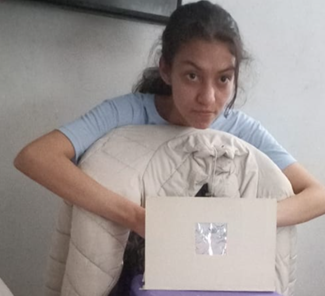
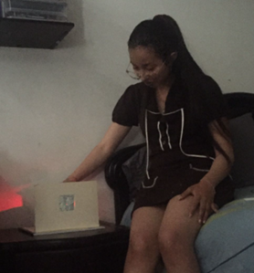
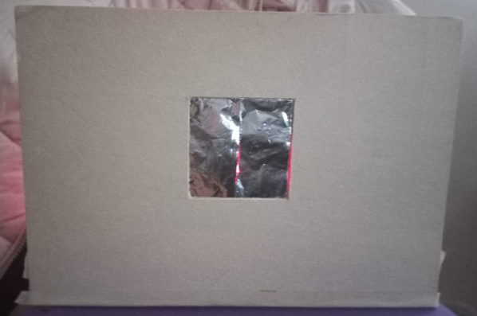
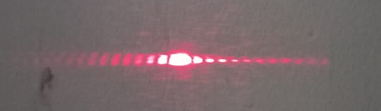
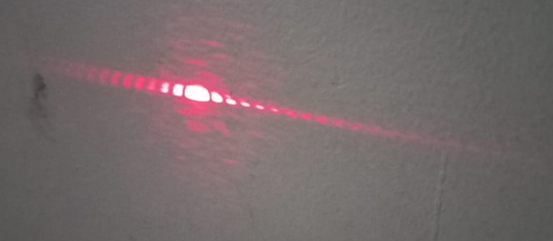
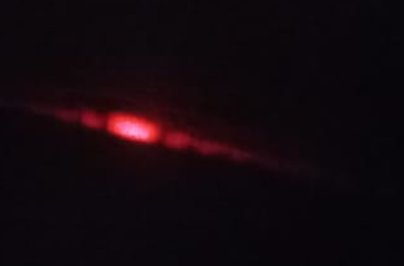
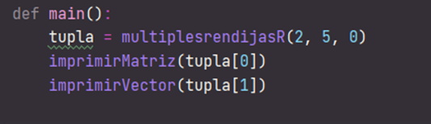
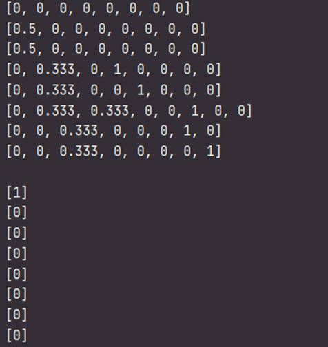
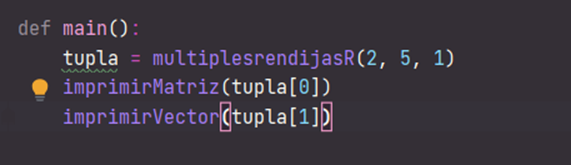
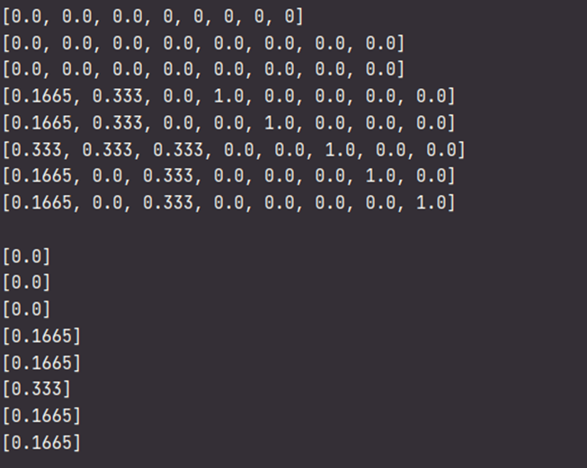

#Montaje del experimento

Introducción:

El experimento de la doble rendija fue realizado por primera vez por el científico Thomas Young en el año 1801, este experimento consistía en emitir luz a través de dos rendijas y observar un patrón de interferencias que es ocasionado luego de que la luz se difractara al pasar por las dos rendijas. Este experimento tiene una gran relevancia en el mundo de la mecánica cuántica ya que mediante el se pueden evidenciar conceptos como:
Superposición: El estado de un sistema puede contener múltiples historias.
Interferencia: Las historias de los sistemas pueden interactuar entre sí.

El experimento de la doble rendija lo realizamos de la siguiente manera:
Utilizamos: 

        •	1/8 de cartón paja
        
        •	Un láser infrarrojo
        
        •	Una hoja de papel aluminio
        
        •	Un bisturí de precisión
        
        •	Cinta de enmascarar
        
        •	Un soporte para poder sostener el laser 
        
        •	lapiz

Pasos:

1) Primero establecimos  un soporte para sostener el laser utilizando una caja mediana blanca.

2) Se utilizo  ¼ del cartón paja,  el restante lo utilizamos para realizar una base triangular para que se sostuviera el cartón paja, también colocarnos un poco de cinta en la base para que el cartón paja se mantuviera estable.

3) Frente al soporte y el láser colocamos el cartón paja y marcamos aproximadamente   donde proyecta el láser en el cartón paja con un lápiz. 

4) Para realizar la doble rendija, tomamos nuestro cartón paja   y con centro en la marca donde proyecto el láser realizamos, dibujamos y cortamos un rectángulo de 3x3, realizamos el mismo rectángulo en el papel aluminio con la misma marca de donde proyecta el láser y le agregamos 1cm de longitud a cada lado para poder pegarlo con cinta en cartón paja. Donde proyecto el laser en el papel aluminio cortamos con el bisturí  dos rendijas paralelas muy cercanas entre sí. 

5) Oscurecimos el cuarto y después de varios intentos pudimos observar el patrón resultante: 

Simulación

Este experimento de doble rendija se puede simular usando la librería que está adjunta en este mismo repositorio, el montaje del experimento de la doble rendija se puede visualizar como un grafo y como una matriz de adyacencia con un vector de estados asociado como se puede ver a continuación.

La matriz y el vector de estados inicial de la simulación probabilística resultan de la siguiente forma:
Utilizando los siguientes comandos

Tras hacer un clic, es decir, moverse en una unidad de tiempo en el experimento, el resultado de la matriz y el vector resultante son los siguientes:

La grafica del vector de estados del experimento probabilístico resulta:

Autores

Carolina Medina Acero
Andrea Valentina Torres Tobar
